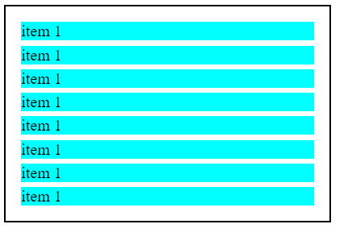
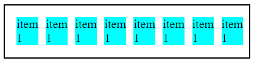
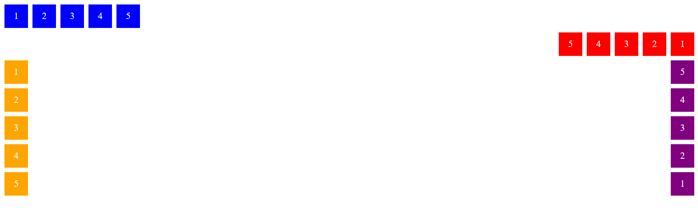
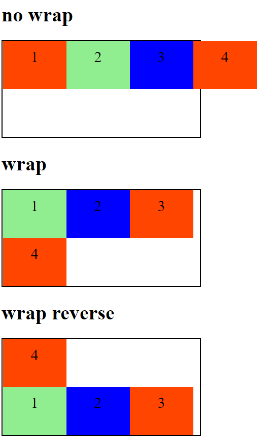
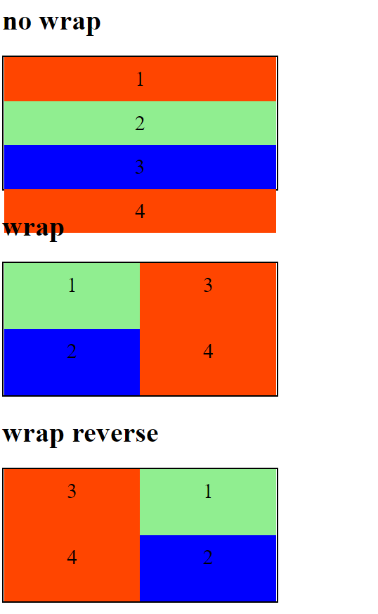

## Posicionando elementos com Flexbox em CSS

Curso onde é ensinado técnicas de flexbox em CSS pelo bootcamp Impulso Javascript Evolution do site Digital Innovation One.

## Propriedades

Display Flex

Flex Wrap

### Display flex

Permite encaixar os itens em uma div:

Sem display:flex:

Com display:flex:

### Flex-direction

Informa a direção dos elementos, podendo ser em linha (row) ou coluna (column). Pode se aplicar a palavra reverse para inverter o sentido deles.

Exemplos abaixo das propriedades row, row-reverse, column e column-reverse.

### Flex-wrap

Opção de quebra de itens quando chegar nas medidas de altura  (min-height) para coluna e largura (min-width) para linhas.

Comportamento para linhas:

Comportamento para colunas:

