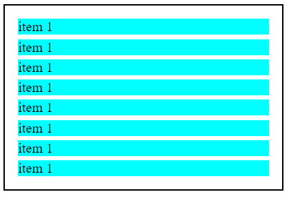
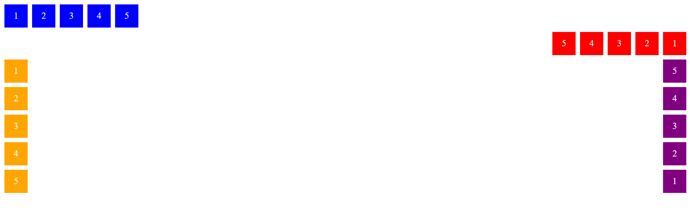
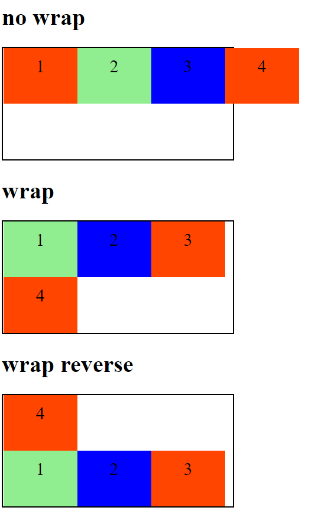
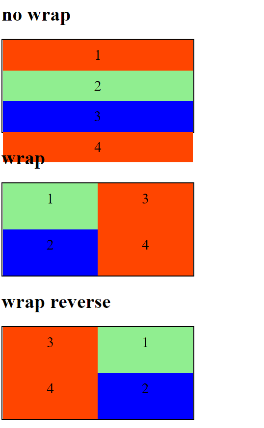
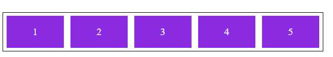
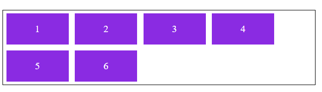
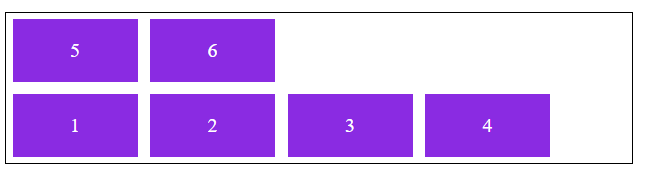
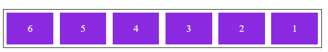
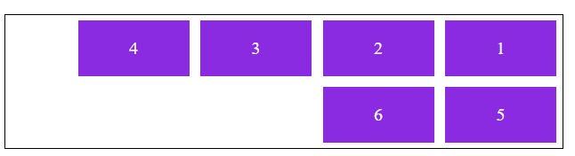
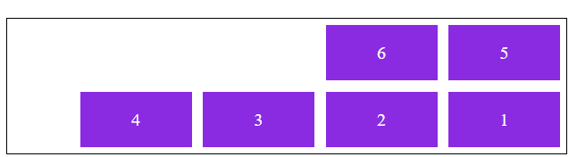

## Posicionando elementos com Flexbox em CSS

Curso onde é ensinado técnicas de flexbox em CSS pelo bootcamp Impulso Javascript Evolution do site Digital Innovation One.

## Display flex

Permite encaixar os itens em uma div:

### Sem display:flex:

### Com display:flex:

## Flex-direction

Informa a direção dos elementos, podendo ser em linha (row) ou coluna (column). Pode se aplicar a palavra reverse para inverter o sentido deles.

Exemplos abaixo das propriedades row, row-reverse, column e column-reverse.

## Flex-wrap

Opção de quebra de itens quando chegar nas medidas de altura  (min-height) para coluna e largura (min-width) para linhas.

Comportamento para linhas:

Comportamento para colunas:

## Flex-flow

É um atalho para as propriedades flex-direction e flex-wrap.

### row nowrap

Ordem da linha natural da esquerda para a direita e sem quebra.

### row wrap

Ordem da linha natural da esquerda para a direita e com quebra de cima para baixo.

### row wrap reverse

Inverte o row wrap deixando a quebra de baixo para cima.

### row-reverse nowrap

Inverte o row deixando a ordem da linha da direita para a esquerda e sem quebra.

### row-reverse wrap

Inverte o row deixando a ordem da linha da direita para a esquerda e com quebra.

### row-reverse wrap-reverse

Inverte o row e o wrap, deixando a direção da linha da direita para a esquerda e a quebra de baixo para cima.

Pode ser usada com column também.

## Justify content

Propriedade para alinhar itens dentro de um container desde que não estejam ocupando 100% do espaço.

### flex-start

Alinham no ínicio do container.

### flex-end

Alinham no final do container.

### center

Alinham no centro do container.

### space-between

Cria um espaçamento igual entre os elementos.

### space-around

O espaçamento do meio é duas vezes maior que o do início e do final.