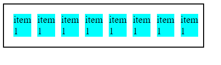
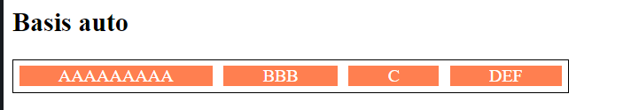

## Posicionando elementos com Flexbox em CSS


Curso onde é ensinado técnicas de flexbox em CSS pelo bootcamp Impulso Javascript Evolution do site Digital Innovation One.

## Display flex

Permite encaixar os itens em uma div:

### Sem display:flex:


### Com display:flex:



## Flex-direction

Informa a direção dos elementos, podendo ser em linha (row) ou coluna (column). Pode se aplicar a palavra reverse para inverter o sentido deles.

Exemplos abaixo das propriedades row, row-reverse, column e column-reverse.


## Flex-wrap

Opção de quebra de itens quando chegar nas medidas de altura  (min-height) para coluna e largura (min-width) para linhas.

Comportamento para linhas:


Comportamento para colunas:


## Flex-flow

É um atalho para as propriedades flex-direction e flex-wrap.

### row nowrap

Ordem da linha natural da esquerda para a direita e sem quebra.


### row wrap

Ordem da linha natural da esquerda para a direita e com quebra de cima para baixo.


### row wrap reverse

Inverte o row wrap deixando a quebra de baixo para cima.


### row-reverse nowrap

Inverte o row deixando a ordem da linha da direita para a esquerda e sem quebra.


### row-reverse wrap

Inverte o row deixando a ordem da linha da direita para a esquerda e com quebra.


### row-reverse wrap-reverse

Inverte o row e o wrap, deixando a direção da linha da direita para a esquerda e a quebra de baixo para cima.


Pode ser usada com column também.

## Justify content

Propriedade para alinhar itens dentro de um container desde que não estejam ocupando 100% do espaço.

### flex-start

Alinham no ínicio do container.

### flex-end

Alinham no final do container.

### center

Alinham no centro do container.

### space-between

Cria um espaçamento igual entre os elementos.

### space-around

O espaçamento do meio é duas vezes maior que o do início e do final.

### Exemplos


## Align items

Diferente do justify-content que trata do espaçamento entre os elementos, a propriedade align-items cuida do alinhamento no eixo vertical.


## Align-content

Parecido com o align-item, porém ele alinha o conteúdo como um todo.


## Flex-grow

Define a proporcionalidade de crescimento dos itens, respeitando o tamanho de seus conteúdos internos. Não é compatível junto com justify-content.


## Flex-basis

É a propriedade que estabelece o tamanho incial do item antes da distribuição de espaço restante dentro dele usando como base o conteúdo interno disposto.

Perceba uma div o comportamento em 4 divs.

### Sem flex-basis


### Com flex-basis auto



Com a flex-basis que por padrão já tem o valor auto, nós controlamos a proporção que cada elemento terá em relação ao espaço. Ele vai ajustar o conteúdo mantendo as propriedades dele e o expandindo, se necessário.

Perceba quando inserimos o valor 0 na flex-basis, o conteúdo não se ajusta automaticamente, pois esta propriedade faz com que todos os elementos respeitam a mesma proporção.


Podemos informar também a largura padrão dos elementos, como por exemplo abaixo a 100px. Perceba que ficou uma "folga" do container pois como informamos que cada item deve ter 100px, ele não vai se ajustar como nos outros exemplos.


## Flex-grow

A propriedade flex-grow faz com que mesmo que os itens contenham a mesma quantidade de caracteres, priorizamos que um deles tenha um tamanho maior no container. Pereceba quando aplicamos um flex-grow: 2 no segundo item. Ele ocupa o dobro do tamanho dos demais.


## Flex-shrink

Pense como o inverso do grow, onde vamos comprimir os elementos de um container. Ele vai se adaptar e se houver quebra de linha, aumenta a altura automaticamente.


Caso deixamos o valor como zero, os itens irão vazar do container.


## Flex (Shorthand)

Podemos utilizar o shorthand **flex** para usar as propriedades flex-grow, flex-basis e flex-shrink em uma declaração só.

Funciona da seguinte forma:

```html
        .flex-1{
            /* grow = 1, shrink = 1, basis = 0 */
            flex: 1;
        }

        .flex-2{
            /* grow = 2, shrink = 1, basis = 0 */
            flex: 2;
        }
```

## Order

Propriedade para ordenar elementos do container.

Por padrão, o valor de order é 0.

Porém, se criamos os seguintes estilos, a ordenação muda:

````html
    <div class="flex-container">
        <div class="item">1</div>
        <div class="item">2</div>
        <div class="item">3</div>
        <div class="item">4</div>
    </div>
    <h2>Order: diferentes</h2>
    <div class="flex-container">
        <div class="item order2">1</div>
        <div class="item order1">2</div>
        <div class="item order3">3</div>
        <div class="item order2">4</div>
    </div>
````

