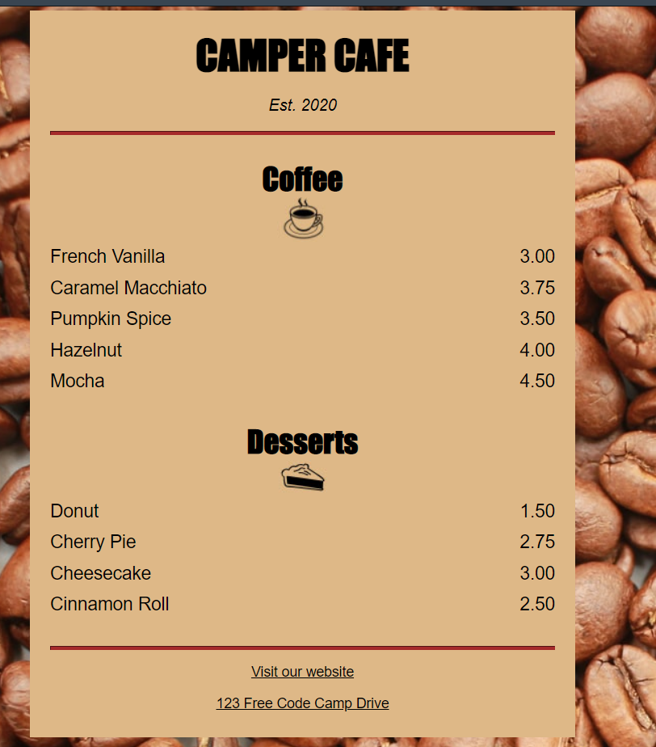

# CAMPER CAFE project

Projeto que aprendo a criar um menu de café pelo site freecodecamp.org.



## Dicas que aprendi neste curso

````html
.menu{
    background-color: burlywood;
    width: 80%;
/* Propriedades para centralizá-la na margem esquerda e direita e limitar a 500px de largura
	para resoluções maiores não esticarem a div*/
    max-width: 500px;
    margin-left: auto;
    margin-right: auto;
    padding: 20px;
}


img{
/* Fazer com a img tenha o mesmo comportamento do header */
    display: block;
    margin-left: auto;
    margin-right: auto;
/* usar margin negativa para subir o seu elemento */
    margin-top: -25px;;
}
````

